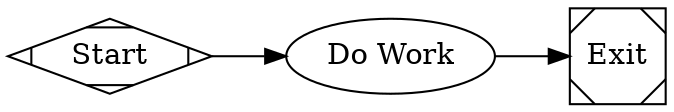
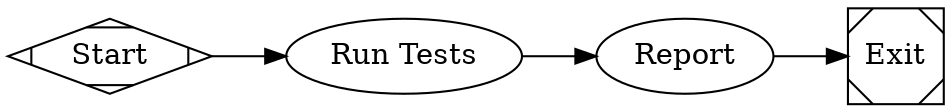
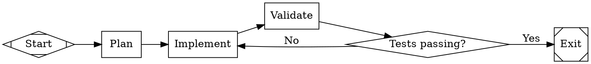
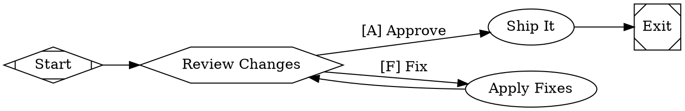
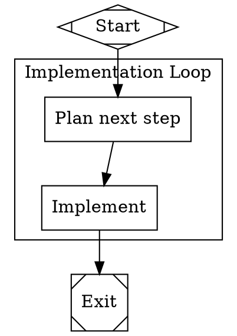
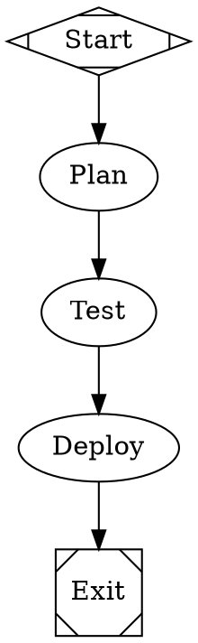
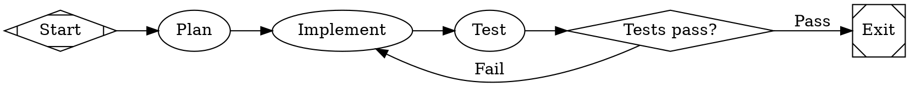
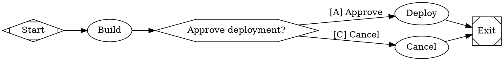

# Attractor CLI - Usage Guide

> **TL;DR**: Attractor runs multi-stage AI workflows defined as Graphviz DOT files. You write a `.dot` file describing nodes (LLM tasks, human gates, conditionals) and edges (transitions), then `attractor run` executes it node by node, writing logs and a checkpoint after each step.

## Overview

Attractor is a DOT-based pipeline engine. You describe a workflow as a directed graph in `.dot` format — nodes are tasks, edges are transitions — and the engine traverses the graph deterministically. Each node invokes a handler (LLM call, human approval gate, conditional branch, etc.) and the outcome of that handler decides which edge to follow next.

This lets you build multi-stage AI workflows that are visual, version-controllable, and resumable after crashes.

## Quick Start

```bash
# Install
pip install -e .

# Validate a pipeline first
attractor validate tests/fixtures/pipelines/simple_linear.dot

# Run it
attractor run tests/fixtures/pipelines/simple_linear.dot

# Run without pausing at human gates
attractor run tests/fixtures/pipelines/human_gate.dot --auto-approve
```

---

## Commands

### `attractor run <pipeline.dot>`

**What it does**: Executes a DOT pipeline from start to finish, traversing nodes in graph order.

**What happens when you run it**:

1. Reads and parses the `.dot` file into an in-memory graph
2. Validates the graph structure (errors block execution; warnings are printed)
3. Mirrors graph-level attributes (like `goal`) into a shared context store
4. Finds the start node (`shape=Mdiamond`) and begins traversal
5. For each node: resolves its handler, executes it, records the outcome
6. Writes a `checkpoint.json` to the logs directory after each node completes
7. Selects the next edge based on conditions, outcome status, and weights
8. At the exit node (`shape=Msquare`): checks that all `goal_gate=true` nodes succeeded
9. Prints a final status line: `[OK]`, `[PARTIAL]`, or `[FAIL]`

**Flags**:

- `--auto-approve` — Skip human gates automatically. The pipeline selects the first available option at every `wait.human` node. Use this in CI or automated runs where no operator is present.
- `--logs <dir>` — Directory for logs and the checkpoint file. Defaults to `./logs/<pipeline-name>`. Each node gets a subdirectory here with `prompt.md`, `response.md`, and `status.json`.

**Example**:

```bash
attractor run my_pipeline.dot --logs ./runs/2026-02-22
```

**Logs directory produced**:

```
./logs/my_pipeline/
    checkpoint.json          # Resumable state snapshot, updated after each node
    <node_id>/
        prompt.md            # The prompt rendered and sent to the LLM
        response.md          # The LLM response text
        status.json          # Outcome: status, notes, failure_reason
```

**Exit codes**:

- `0` — Pipeline finished with SUCCESS or PARTIAL_SUCCESS
- `1` — Pipeline failed, parse error, or validation error

**Important Notes**:

- If the process is killed mid-run, the `checkpoint.json` in the logs directory holds the last completed node and full context. The engine can resume from it (API-level; there is no CLI resume flag yet).
- If a node with `goal_gate=true` did not succeed by the time the exit node is reached, the engine jumps to the configured `retry_target` instead of exiting. If no retry target is configured, the pipeline fails with an error.

---

### `attractor validate <pipeline.dot>`

**What it does**: Parses the DOT file and runs all lint rules. Prints diagnostics and exits without executing anything.

**What happens when you run it**:

1. Reads and parses the `.dot` file
2. Runs all built-in lint rules (see Validation Rules below)
3. Prints each diagnostic with severity tag: `[ERROR]`, `[WARN]`, or `[INFO]`
4. For errors, also prints the suggested fix
5. Prints a summary line with counts

**Example output (valid pipeline)**:

```
Valid: my_pipeline.dot (6 nodes, 7 edges)
```

**Example output (invalid pipeline)**:

```
  [ERROR] start_node: Pipeline must have exactly one start node (shape=Mdiamond)
         Fix: Add a node with shape=Mdiamond
  [WARN] prompt_on_llm_nodes (my_task): LLM node 'my_task' has no prompt or label
         Fix: Add a prompt or label attribute

Summary: 1 error(s), 1 warning(s) in my_pipeline.dot (4 nodes, 3 edges)
```

**Exit codes**:

- `0` — No errors (warnings are allowed)
- `1` — One or more errors, or parse failure

---

## Writing DOT Pipeline Files

Attractor accepts a strict subset of Graphviz DOT. The file must be a single `digraph` with directed edges (`->`). Undirected edges (`--`), multiple graphs per file, and HTML labels are rejected.

### Minimal Working Pipeline



Every valid pipeline needs:
- Exactly one `shape=Mdiamond` node (start)
- At least one `shape=Msquare` node (exit)
- All nodes reachable from start
- No incoming edges on the start node
- No outgoing edges on the exit node

### Node Shapes and What They Do

The `shape` attribute determines which handler runs for a node. The `type` attribute overrides this if set.

| Shape           | Handler Type         | What It Does |
|-----------------|----------------------|--------------|
| `Mdiamond`      | `start`              | Pipeline entry point. No-op, runs immediately. Required. |
| `Msquare`       | `exit`               | Pipeline exit point. No-op, triggers goal gate checks. Required. |
| `box`           | `codergen`           | Calls the LLM backend with the node's `prompt`. Default for all nodes without an explicit shape. |
| `hexagon`       | `wait.human`         | Pauses execution and presents options to a human operator. Options come from outgoing edge labels. |
| `diamond`       | `conditional`        | No-op handler. Routing is done by conditions on its outgoing edges. |
| `component`     | `parallel`           | Fans out execution to multiple branches concurrently. |
| `tripleoctagon` | `parallel.fan_in`    | Waits for parallel branches to complete and consolidates results. |
| `parallelogram` | `tool`               | Runs a shell command specified in `tool_command`. |
| `house`         | `stack.manager_loop` | Supervisor loop that observes and steers a child pipeline. |

### Node Attributes Reference

| Attribute             | Type     | Default       | What It Controls |
|-----------------------|----------|---------------|-----------------|
| `label`               | String   | node ID       | Display name. Used as the fallback prompt for LLM nodes if `prompt` is not set. |
| `shape`               | String   | `box`         | Determines handler type (see table above). |
| `type`                | String   | (from shape)  | Explicit handler override. Takes precedence over shape-based resolution. |
| `prompt`              | String   | `""`          | Instruction sent to the LLM. Supports `$goal` variable expansion. |
| `max_retries`         | Integer  | `0`           | Additional attempts beyond the first. `max_retries=3` means 4 total executions. |
| `goal_gate`           | Boolean  | `false`       | If `true`, this node must succeed before the pipeline can exit. |
| `retry_target`        | String   | `""`          | Node ID to jump to if this node fails and retries are exhausted. |
| `fallback_retry_target` | String | `""`         | Secondary retry target if `retry_target` is missing or its node does not exist. |
| `allow_partial`       | Boolean  | `false`       | Accept PARTIAL_SUCCESS when retries are exhausted instead of marking as FAIL. |
| `timeout`             | Duration | (none)        | Max execution time. Format: `900s`, `15m`, `2h`, `250ms`, `1d`. |
| `auto_status`         | Boolean  | `false`       | If the handler writes no status, auto-generate a SUCCESS outcome. |
| `fidelity`            | String   | inherited     | Context carried into this node's LLM session. Options: `full`, `truncate`, `compact`, `summary:low`, `summary:medium`, `summary:high`. |
| `thread_id`           | String   | (derived)     | LLM session key. Nodes with the same thread ID reuse the same session under `full` fidelity. |
| `class`               | String   | `""`          | Comma-separated CSS-like class names for model stylesheet targeting. |
| `llm_model`           | String   | inherited     | LLM model identifier. |
| `llm_provider`        | String   | (auto)        | LLM provider key. Auto-detected from model name if unset. |
| `reasoning_effort`    | String   | `"high"`      | LLM reasoning effort: `low`, `medium`, `high`. |

### Graph-Level Attributes

Declared in a `graph [...]` block or as top-level `key = value` statements.

| Attribute               | Type     | Default | What It Controls |
|-------------------------|----------|---------|-----------------|
| `goal`                  | String   | `""`    | Human-readable pipeline goal. Available as `$goal` in all node prompts. |
| `label`                 | String   | `""`    | Display name for the graph. |
| `default_max_retry`     | Integer  | `50`    | Global retry ceiling for nodes that do not set `max_retries`. |
| `retry_target`          | String   | `""`    | Node to jump to if the exit is reached with an unsatisfied goal gate. |
| `fallback_retry_target` | String   | `""`    | Secondary jump target if `retry_target` is missing. |
| `default_fidelity`      | String   | `""`    | Default fidelity mode for all LLM nodes in the pipeline. |
| `model_stylesheet`      | String   | `""`    | CSS-like stylesheet for per-node LLM model and provider defaults. |

### Edge Attributes Reference

| Attribute    | Type     | Default | What It Controls |
|--------------|----------|---------|-----------------|
| `label`      | String   | `""`    | Human-facing caption and routing key used by the `wait.human` handler. |
| `condition`  | String   | `""`    | Boolean guard expression. Edge is only followed if this evaluates to `true`. |
| `weight`     | Integer  | `0`     | Priority for edge selection. Higher weight wins among equally eligible edges. |
| `fidelity`   | String   | (none)  | Overrides the fidelity mode for the target node. Highest precedence. |
| `thread_id`  | String   | (none)  | Overrides the thread ID for session reuse at the target node. |
| `loop_restart` | Boolean | `false` | When `true`, terminates the current run and re-launches with a fresh log directory. |

---

## Condition Expressions

Conditions on edges are evaluated after each node completes. An edge is only eligible if its condition is `true`.

**Syntax**:

```
key=value          # equality (case-insensitive)
key!=value         # inequality
expr AND expr      # both must be true (uppercase AND required)
expr OR expr       # either must be true (uppercase OR required)
NOT expr           # negation (uppercase NOT required)
key                # bare truthy check (non-empty string or non-zero number)
```

**Built-in keys available in conditions**:

| Key               | What It Resolves To |
|-------------------|---------------------|
| `outcome`         | Status of the last node: `success`, `fail`, `partial_success`, `retry`, `skipped` |
| `status`          | Alias for `outcome` |
| `preferred_label` | The preferred edge label returned by the last handler |
| Any context key   | Value from the shared context store (e.g., `last_stage`, `human.gate.selected`) |

**Examples**:

```dot
// Follow this edge only when the last node succeeded
gate -> exit [condition="outcome=success"]

// Follow this edge when the last node did not succeed
gate -> retry_step [condition="outcome!=success"]

// Compound condition
gate -> done [condition="outcome=success AND last_stage=validate"]

// Human gate selection
review -> ship [condition="human.gate.selected=A"]
```

---

## Pipeline Examples

### Example 1: Simple Linear Pipeline



What happens: Start -> run_tests (LLM called with "Run the test suite...") -> report (LLM called with "Summarize...") -> Exit. No conditions. Chained edge syntax `A -> B -> C` expands into individual edges.

### Example 2: Branching with a Conditional



What happens: The `gate` node (diamond shape) is a no-op. Its outgoing edges carry the conditions. If `validate` returned SUCCESS, the `outcome=success` edge is followed to exit. Otherwise the `outcome!=success` edge loops back to `implement`. Because `validate` has `goal_gate=true`, the pipeline will not exit until it has a SUCCESS or PARTIAL_SUCCESS outcome.

### Example 3: Human Approval Gate



What happens: The `review_gate` node blocks until an operator types `A` or `F` at the terminal. Typing `A` routes to `ship_it`; typing `F` routes to `fixes`, which loops back to `review_gate` for another review cycle. With `--auto-approve`, the engine always picks the first option (`[A] Approve`).

**How the console prompt looks**:

```
[?] Review Changes
  [A] [A] Approve
  [F] [F] Fix
Select:
```

### Example 4: Node Defaults and Subgraphs



Inside `cluster_loop`, `plan` inherits `thread_id="impl-loop"` and `timeout="1800s"`. `implement` inherits `thread_id="impl-loop"` but overrides `timeout` to `3600s`. The subgraph label `"Implementation Loop"` also derives the CSS class `implementation-loop` for model stylesheet targeting.

---

## How Edge Selection Works

After each node completes, the engine picks the next edge using this priority order:

1. **Condition-matching edges** — If any edge has a `condition` attribute that evaluates to `true`, pick the highest-weight one among them (lexical tiebreak on node ID).
2. **Preferred label** — If no conditions matched and the node's outcome specified a `preferred_label`, find the first edge whose label matches after normalization (lowercase, strip accelerator prefix like `[A]`, `A)`, `A -`).
3. **Suggested next IDs** — If the outcome specified `suggested_next_ids`, find the first edge pointing to one of those node IDs.
4. **Highest weight among unconditional edges** — Among edges with no `condition`, pick the highest `weight` (default is `0`). Lexical tiebreak on target node ID.
5. **Any edge** — If all else fails, pick by weight and then lexically.

This means: conditional edges always win. Among unconditional edges, `weight` controls priority. If all weights are equal, alphabetical order on node ID decides.

---

## How Retry Works

```dot
implement [
    label="Implement",
    prompt="Implement the feature",
    max_retries=3,             // 4 total attempts (1 initial + 3 retries)
    allow_partial=true,        // accept PARTIAL_SUCCESS if all retries exhaust
    retry_target=plan          // jump to 'plan' if completely failed
]
```

- `max_retries=N` allows N additional attempts after the first. `max_retries=3` means up to 4 total executions.
- Between retries, the engine uses exponential backoff: starting at 200ms, doubling each attempt, capped at 60s, with jitter.
- If the handler returns `RETRY`, the engine re-runs the node (up to the limit).
- If the handler returns `FAIL`, the engine immediately stops retrying and looks for a fail route.
- If retries are exhausted:
  - With `allow_partial=true`: outcome becomes PARTIAL_SUCCESS and execution continues.
  - Without it: outcome becomes FAIL, and the engine looks for a `condition="outcome=fail"` edge, then `retry_target`, then `fallback_retry_target`, then fails the pipeline.

---

## Goal Gates

Mark critical nodes with `goal_gate=true`. When the pipeline reaches an exit node, it checks whether all visited goal gate nodes succeeded. If any did not:

1. The engine jumps to that node's `retry_target` (or `fallback_retry_target`).
2. If no retry target is set on the node, it falls back to the graph-level `retry_target`.
3. If nothing is configured, the pipeline fails with an error.



If `test` fails: the pipeline tries to exit but finds an unsatisfied goal gate, then jumps back to `plan`.

---

## Human Gate Details

Human gates (`shape=hexagon` or `type="wait.human"`) pause execution until an operator picks an option.

**Option keys are parsed from edge labels** using these patterns:

| Edge label pattern | Example            | Key extracted |
|--------------------|--------------------|---------------|
| `[K] Label`        | `[A] Approve`      | `A`           |
| `K) Label`         | `A) Approve`       | `A`           |
| `K - Label`        | `A - Approve`      | `A`           |
| First character    | `Approve`          | `A`           |

**Timeout default**: Set `human.default_choice` on the node to specify which edge target to follow if the operator does not respond:

```dot
review_gate [
    shape=hexagon,
    label="Approve deployment?",
    human.default_choice=ship_it
]
```

**Context written by the human gate handler**:
- `human.gate.selected` — the key of the selected option (e.g., `"A"`)
- `human.gate.label` — the full label of the selected edge (e.g., `"[A] Approve"`)

These are available in downstream edge conditions:

```dot
gate -> ship [condition="human.gate.selected=A"]
gate -> hold [condition="human.gate.selected=F"]
```

---

## Validation Rules

The `attractor validate` command (and the engine before every run) checks these rules:

| Rule                   | Severity | Description |
|------------------------|----------|-------------|
| `start_node`           | ERROR    | Exactly one `shape=Mdiamond` node (or a node with ID `start`) must exist. |
| `terminal_node`        | ERROR    | At least one `shape=Msquare` node (or ID `exit` or `end`) must exist. |
| `edge_target_exists`   | ERROR    | Every edge source and target must reference a declared node. |
| `start_no_incoming`    | ERROR    | The start node must have no incoming edges. |
| `exit_no_outgoing`     | ERROR    | The exit node must have no outgoing edges. |
| `reachability`         | ERROR    | Every node must be reachable from the start node via edges. |
| `retry_target_exists`  | WARNING  | If a node's `retry_target` references a node ID that does not exist in the graph. |
| `prompt_on_llm_nodes`  | WARNING  | LLM nodes (`shape=box`) with no `prompt` and whose `label` equals the node ID. |

Errors block execution. Warnings are printed but execution proceeds.

---

## Logs and Checkpoint Files

After each node completes, the engine writes:

**`{logs_root}/checkpoint.json`** — Updated after every node. Contains the last completed node ID, all completed nodes in order, retry counters, and a full snapshot of the context store. The engine can resume from this file if the process crashes.

```json
{
  "timestamp": "2026-02-22T10:30:00Z",
  "current_node": "validate",
  "completed_nodes": ["start", "plan", "implement", "validate"],
  "node_retries": {"implement": 1},
  "context": {
    "graph.goal": "Implement and validate a feature",
    "outcome": "success",
    "last_stage": "validate"
  },
  "logs": []
}
```

**`{logs_root}/{node_id}/prompt.md`** — The rendered prompt sent to the LLM (after `$goal` expansion).

**`{logs_root}/{node_id}/response.md`** — The raw LLM response text.

**`{logs_root}/{node_id}/status.json`** — The handler's outcome:

```json
{
  "status": "success",
  "notes": "Stage completed: validate",
  "failure_reason": ""
}
```

---

## Context Store

The context is a shared key-value store that persists across all nodes in a run. Handlers read and write it to pass data between stages.

**Engine-managed keys**:

| Key                              | Set By  | Value |
|----------------------------------|---------|-------|
| `outcome`                        | Engine  | Status of the last completed node (`success`, `fail`, etc.) |
| `preferred_label`                | Engine  | Preferred edge label from the last handler |
| `graph.goal`                     | Engine  | The pipeline's `goal` attribute |
| `current_node`                   | Engine  | ID of the currently executing node |
| `last_stage`                     | Handler | ID of the last completed stage |
| `last_response`                  | Handler | First 200 characters of the last LLM response |
| `human.gate.selected`            | Handler | Key of the selected human gate option |
| `human.gate.label`               | Handler | Full label of the selected human gate option |
| `internal.retry_count.<node_id>` | Engine  | Retry counter for a specific node |

**Key namespace conventions**:

| Prefix       | Purpose |
|--------------|---------|
| `context.*`  | Semantic state shared between nodes |
| `graph.*`    | Graph attributes mirrored at initialization |
| `internal.*` | Engine bookkeeping (retry counters, timing) |
| `parallel.*` | Parallel handler state |
| `human.gate.*` | Human interaction state |
| `work.*`     | Per-item context for parallel work items |

---

## Common Workflows

### Workflow: Implement-Validate Loop

A loop that retries implementation until tests pass.



**End result**: The pipeline exits only when `test` returns SUCCESS. Otherwise it loops back to `implement`.

### Workflow: Human Review Before Deploy

A pipeline that requires human sign-off before deploying.



**Run interactively**:
```bash
attractor run deploy.dot
```

**Run in CI (auto-approves)**:
```bash
attractor run deploy.dot --auto-approve
```

---

## Installation

Requires Python 3.12+.

```bash
# Install with pip (editable mode for development)
pip install -e .

# Or with uv
uv pip install -e .
```

The `attractor` CLI entry point is registered in `pyproject.toml`:

```toml
[project.scripts]
attractor = "attractor.cli:main"
```

---

## Troubleshooting

**Error: `Parse error at line N, col M`**

- Cause: The `.dot` file has a syntax error — likely a missing comma between attributes, an undirected `--` edge, or an unquoted string containing spaces.
- Fix: Check the line reported. Commas are required between attributes inside `[...]` blocks. All string values must be double-quoted.

**Error: `Pipeline must have exactly one start node`**

- Cause: No node with `shape=Mdiamond` exists, or there are multiple.
- Fix: Add exactly one `start [shape=Mdiamond, label="Start"]` node.

**Error: `Node 'X' is not reachable from start`**

- Cause: The node exists in the file but no edge path connects it to the start node.
- Fix: Add an edge from a reachable node to `X`, or remove `X` if it is unused.

**Error: `Stage 'X' failed with no outgoing fail edge`**

- Cause: Node `X` returned FAIL and has no edge with `condition="outcome=fail"` and no `retry_target`.
- Fix: Add a fail edge from `X` to an error handler node, or add `retry_target=<node_id>` to node `X`.

**Error: `Goal gate 'X' unsatisfied and no retry target`**

- Cause: Node `X` has `goal_gate=true`, its outcome was not SUCCESS or PARTIAL_SUCCESS, and neither the node nor the graph has a `retry_target` configured.
- Fix: Add `retry_target=<node_id>` to the goal gate node, or set `retry_target` at the graph level in the `graph [...]` block.

**Pipeline runs but LLM nodes produce only simulated responses**

- Cause: No `codergen_backend` was provided to the engine. When running via the CLI without a configured backend, the codergen handler returns a placeholder string.
- Fix: This is expected behavior for the default CLI. Wire up a `CodergenBackend` implementation in code to connect a real LLM.

**Human gate does not pause; always picks first option**

- Cause: Either `--auto-approve` was passed, or the engine was initialized with `AutoApproveInterviewer`.
- This is intentional when running in automated contexts. Remove `--auto-approve` to use the interactive console interviewer.
